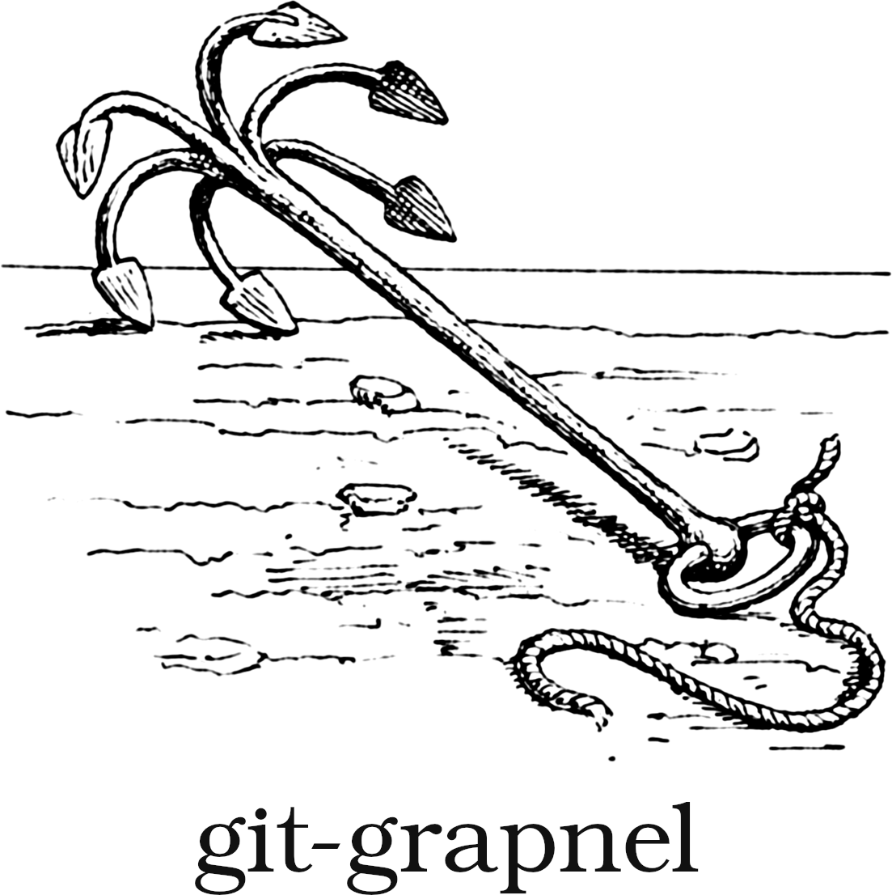

<div align="center"></div>
<p>&nbsp;</p>

> This  is  a collection  of  client-side  git hooks  I  use  in all  my  repos,
> written  in Bash.  These  aren't  meant to  be  used  as&#8209;is, but  rather
> as  examples  and  inspiration  for  you own  hooks.  Each  script  is  linted
> with  [shellcheck](https://github.com/koalaman/shellcheck)   and  tested  with
> [bats](https://github.com/bats-core/bats-core).

## About git hooks

A hook is  simply an executable file  that git will call either  before or after
performing some operation. A  hook is always run at the  root of the repository,
and is  passed some arguments  relevant to the  on-going operation. It  can also
force git to abort the current task by returning a non-zero exit code.

## Hooks

### [`pre-commit`](https://github.com/cheap-glitch/git-grapnel/blob/main/src/pre-commit.sh)
This hook is run  whenever committing to the repo, and can  be bypassed with the
`--no-verify` option.

The script prevents committing at all if  there's no `.gitignore` in the repo or
if some "dangerous" files aren't properly excluded.

### [`commit-msg`](https://github.com/cheap-glitch/git-grapnel/blob/main/src/commit-msg.sh)
This hook is run  whenever committing to the repo, and can  be bypassed with the
`--no-verify` option.

For repos owned by the committer (i.e., repos that aren't GitHub forks), it will:
 * enforce the [Conventional Commits](https://www.conventionalcommits.org/en/v1.0.0/) specification
 * add an emoji before the commit message type

It will also, regardless of the repo type:
 * check the spelling of  the whole  message (including an optional description)
   and highlight possible typos
 * convert  pairs of  single  quotes (`''`) into  a single  back quote  (this is
   useful when you're used to surrounding your commit message with double quotes
   on the command line)

Amending commits that don't modify the commit message are ignored.

External programs used:
 * `curl` and [jq](https://stedolan.github.io/jq/) to check for forks and  cache
   the result
 * `aspell` to check for possible misspelled words

### [`pre-push`](https://github.com/cheap-glitch/git-grapnel/blob/main/src/pre-push.sh)
This hook  is run whenever  pushing to  a remote, and  can be bypassed  with the
`--no-verify` option.

It  automatically lints  the codebase  and run  the testing  scripts present  in
`package.json`, preventing the transfer of objects should any of them fail.

### [`post-merge`](https://github.com/cheap-glitch/git-grapnel/blob/main/src/post-merge.sh)
This hook  is run after  a successful merge. It  reinstalls the Node  modules as
needed to keep them in sync with `package-lock.json`.

## Installing a client-side hook

### Copying the script
The simplest way to install a hook script is to copy it in the `hooks` directory
located inside the `.git` folder of your repo. Note that you will need to remove
the extension for `git` to pick it up.

### Using a link
If  you want  to reuse  your scripts  in several  repos, soft  links are  a good
solution, e.g.:
```text
ln -s -T </path/to/script.sh> </path/to/repo>/.git/hooks/commit-msg
```

Here's an  example of a  script to automatically update  the hooks of  every git
repo under `~`, using [fd](https://github.com/sharkdp/fd):
```bash
for gitfolder in $(fd -H -t d '^.git$' "${HOME}"); do
	rm -r "${gitfolder}/hooks"/* &> /dev/null

	for hook in /path/to/hooks/folder/*.sh; do
		ln -sf -T "${hook}" "${gitfolder}/hooks/$(basename "${hook}" .sh)"
	done
done
```

### Add a hook to every new git repo
You can  use a git template  to ensure that  every newly created repo  will have
some hooks set up:
 1. Create an empty folder somewhere (e.g. `~/.my-git-template/`)
 2. Add a `hooks` folder in it with the scripts you want to use
 3. Run `git config --global init.templateDir ~/.my-git-template`

## Related

 * [Pro Git, 8.3 Customizing Git - Git Hooks](https://git-scm.com/book/en/v2/Customizing-Git-Git-Hooks) - More infos on git hooks
 * [git-toolbelt](https://github.com/nvie/git-toolbelt) - A collection of convenient utilities for everyday git usage

## License

```text
Copyright (c) 2020-present, cheap glitch

Permission to use, copy, modify, and/or distribute this software for any purpose
with or without fee is hereby  granted, provided that the above copyright notice
and this permission notice appear in all copies.

THE SOFTWARE  IS PROVIDED "AS IS"  AND THE AUTHOR DISCLAIMS  ALL WARRANTIES WITH
REGARD TO THIS SOFTWARE INCLUDING  ALL IMPLIED WARRANTIES OF MERCHANTABILITY AND
FITNESS.  IN NO  EVENT  SHALL THE  AUTHOR  BE LIABLE  FOR  ANY SPECIAL,  DIRECT,
INDIRECT, OR CONSEQUENTIAL DAMAGES OR ANY DAMAGES WHATSOEVER RESULTING FROM LOSS
OF USE, DATA OR  PROFITS, WHETHER IN AN ACTION OF  CONTRACT, NEGLIGENCE OR OTHER
TORTIOUS ACTION, ARISING OUT OF OR IN  CONNECTION WITH THE USE OR PERFORMANCE OF
THIS SOFTWARE.
```
